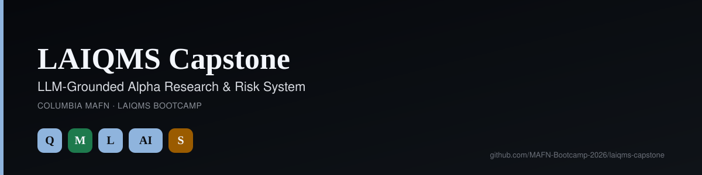

<p align="center"></p>

# LAIQMS Capstone: LLM-Grounded Alpha Research & Risk System

**An end-to-end quantitative research and risk pipeline** — built as the capstone project for Columbia University's [MAFN](https://www.math.columbia.edu/mafn/incoming-student-summer-program/) **LAIQMS bootcamp** (an optional summer program preparing incoming Master of Financial Engineering students for AI/ML/LLM/quant/systems-design interviews).

One notebook, run top to bottom, that builds a real system in the order a quant research desk actually builds one: clean data → engineered features → a validated ML model → an evidence-grounded research layer → a portfolio with real risk controls → a production architecture to run it in.

[](notebook/laiqms_capstone.ipynb)
[](requirements.txt)
[](LICENSE)

## What this demonstrates

| Stage | What it builds | Core techniques |
|---|---|---|
| **1 — Data, Returns & Labels** | A clean, point-in-time market-data contract with leak-free return labels | Log-return calculus, covariance/PCA, VaR & expected shortfall, regime-switching simulation, FFT cycle detection, Black–Scholes & Greeks |
| **2 — Feature Engine** | A point-in-time feature pipeline built with real data-structure discipline | Arrays/heaps/monotonic stacks for rolling stats, binary search for as-of joins, graph/DAG pipeline ordering, dynamic programming |
| **3 — ML/AI Model** | A walk-forward validated classifier ensemble with an honest model card | Time-series cross-validation (no leakage), logistic regression / random forest / gradient boosting / small neural net, calibration, ROC-AUC/PR-AUC/Brier score |
| **4 — LLM Research Layer** | An evidence-grounded research assistant — every claim traced to a retrieved source | TF-IDF retrieval + cosine similarity (a fully local, dependency-free RAG), claim-to-evidence grounding checks |
| **5 — Portfolio, Execution & Risk** | Strategy construction with realistic frictions and a full risk report | Mean-variance/risk-budget construction, transaction-cost modeling, options overlay, drawdown/turnover/exposure limits |
| **6 — Production System Design** | The AWS architecture, IAM policy, orchestration, and monitoring this would actually run on | Least-privilege IAM, Step Functions pipeline, CloudWatch drift/freshness monitoring, cost estimate, incident runbook |

Plus a SQL analytics layer (stdlib `sqlite3`, no server) answering the questions a real desk asks of these outputs: best strategy by Sharpe, top candidates by ensemble score, expected loss by credit rating.

## Why it's built this way

Two rules govern every module (the same rules the bootcamp's lectures are built on):

1. **80/20 coverage.** Every stage covers the ~20% of techniques that carry ~80% of real interview and on-the-job value — no encyclopedic detours.
2. **Nothing runs on the future.** Every feature, label, and validation split respects point-in-time information — the single most common way real quant models silently cheat.

## Run it yourself

```bash
git clone git@github.com:MAFN-Bootcamp-2026/laiqms-capstone.git
cd laiqms-capstone
pip install -r requirements.txt
jupyter nbconvert --to notebook --execute notebook/laiqms_capstone.ipynb --output executed.ipynb
```

The notebook runs fully **offline** on a reproducible synthetic market — a fixed random seed generates ~3 years of daily prices for a 12-stock universe plus asset-class ETFs, so it needs no data downloads, no API keys, and no cloud credentials to reproduce every result below.

`sample_outputs/` holds the actual JSON/CSV artifacts the notebook produces — the model card, walk-forward predictions, portfolio risk report, RAG research briefs, and the final-defense prompts — so you can see the shape of the output without re-running anything.

## Repository layout

```
notebook/           laiqms_capstone.ipynb   — the full pipeline, already executed with outputs
sample_outputs/      per-stage JSON/CSV artifacts the notebook produces
requirements.txt     exact dependencies (numpy, pandas, scipy, scikit-learn)
.github/workflows/   CI: re-executes the notebook on every push to catch breakage
```

## About the program

LAIQMS (Large-model/AI, Quant, ML & Systems) is the bootcamp's framework for treating quantitative finance as the foundation other engineering disciplines build on — not a separate track from them. This capstone is the single project that ties all five pillars together into one system.

## License

MIT — see [LICENSE](LICENSE). The synthetic market data and any resemblance between fictional tickers/architecture and real systems is illustrative only; nothing here is investment advice or production trading infrastructure.
